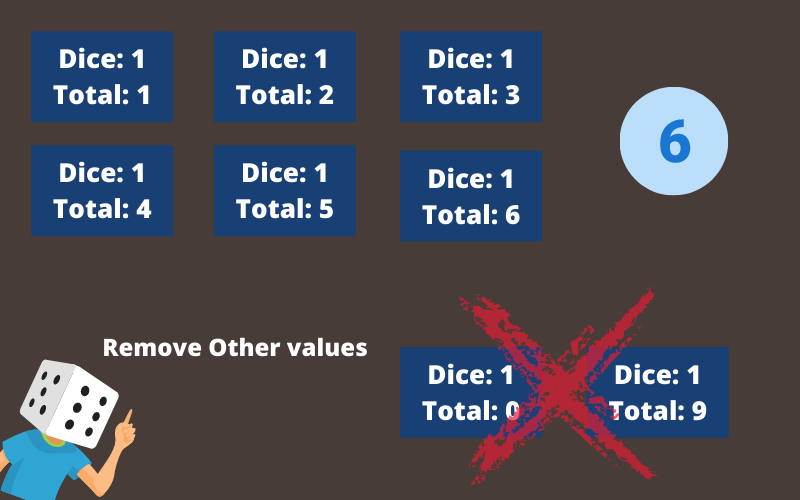
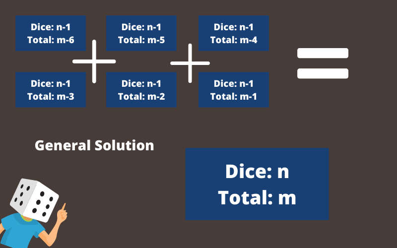

I'm sure a lot of you have heard of dynamic programming maybe while getting into competitive programming and it's usually part of any preliminary algorithm's class too.

A lot of people usually run away from DP problems, mainly because it involves recursion even I'll admit it they are a little harder to comprehend at first. So that's what we'll be working on today, we'll try to understand the basic principle of dynamic programming, and maybe next time you face a DP problem, you don't shy away.

Let's look at the [definition](https://www.educative.io/courses/grokking-dynamic-programming-patterns-for-coding-interviews/m2G1pAq0OO0) first - 

"Dynamic Programming (DP) is an algorithmic technique for solving an optimization problem by breaking it down into simpler subproblems and utilizing the fact that the optimal solution to the overall problem depends upon the optimal solution to its subproblems."

While playing several games involving dice (*dnd fans*), you might care about rolling a particular total and as you probably know intuitively some totals are more likely than others. 

Okay, but what does it mean? I'll start explaining with an example - 

For example, rolling two dices for a 12 is not very likely as there's only one way to do it (two 6's). On the other hand, rolling a 7 is much more likely.

Let's ask a general question here that will let us precisely figure out these values. 

"Given 'n' dice each with sides 1-6, how many different ways can we roll a total of 'm'."

```
Dice: n
Total: m
```

With 2 dices, rolling out a total of 7 is pretty easy to calculate intuitively. (6 times).

With 2 dices, rolling a 12 is only a single case so it's 6 times more likely to roll a 7 when playing with 2 dices.

This was easy to figure out but we are interested in finding a general algorithm for this no matter how many dices are there or how big the total.

```
Dice: n
Total: m
```

For instance, if we had 10 dice how many ways are there to roll a total of 28?
```
Dice: 10
Total: 28
```

### BruteForce

Let's start with the most obvious solution,  in this case, we can list out all of the ways to roll 10 dice and count how many of them total to 28. 
This is a correct solution to the problem but it's not particularly an *efficient* solution. 

It was perfectly fine when working with 2 dice when there are 36 ways to roll. (*how?*)

(A dice has 6 possible rolls)
`6^2 = 36`  
 But with 10 dice, that's more than 60 million
 `6^10 = 60,466,176`
 
 Far too many for a human in any reasonable amount of time and while a modern computer could probably make it through all of those possibilities in under a minute, we could just ask what about 20 dices or 30 dices, you see where I am going with this?
 
 A common strategy for designing algorithms is to think about them recursively that is to say solving our big problem by breaking it down into similar smaller problems.
 
 Remember that we are trying to figure out how many ways we can use n dice to roll a total of M, so let's start with the easiest problems of this form where n is equal to 1 meaning we only roll one dice.
 
 ```
 Dice: 1
 Total: m
 ```

 In these cases, the problem is pretty easy for all values of M from 1 to 6 there's exactly one way to roll that value.
 
  
 
## Recursive Problem Solving
So now let's try to answer a slightly bigger question of how many ways are there to use two dice to roll a total of 8.
 
Well, a total from two rolls can be thought of as the result of one roll with a second roll added to it and that second roll must be a 1-6. So for the overall total to be an 8 then the first roll must be a 7, 6, 5, 4, 3, or 2 respectively.
 
How many ways are there for that to happen well we know that for one dice a 7 is impossible and we also know there's exactly one way for one dice to roll a 6, 5, 4, 3, or 2 so the sum of all of these values i.e 5 is the number of ways we can roll an 8 with 2 dice.

```
Dice: 2
Total: 8 // 5
```

Maybe it seems like we're overcomplicating a simple problem and you are right but sometimes precisely describing a smaller problem helps in generating a more general solution.

In this case, we generalize and say that for n dice to roll a total of M then the first n minus 1 dice must roll a total of ⬇



Adding up each of those six values will therefore give us the answer we want.

This gives us a recursive algorithm for calculating the answer to our question to roll a total of 28 with 10 dice the total of the first 9 dice must be a 27, 26, 25, 24, 23, or 22 and how do we calculate them?

Let's say to calculate 9 dice for a total of 27?

```
Dice: 9
Total: 27
```
We could follow the same recursive process with 8 dice and 26, 25, 24, 23, 22 and we can keep repeating this process until we hit the base case i.e a single dice (*where we know the answer*)

```
Dice: 1
Total: 20 // 0 
```

Taking the number of times we have to repeat this process, it looks this strategy is pretty inefficient too. This recursive algorithm is no better than our original plan to check all the values. 

But if you look closely at the process, you'll feel that there is a lot of repeated work. We'll be calculating the same thing multiple times. After we have calculated it once though, there is no reason to calculate it again and again. If we somehow store the value someplace safe filing it away in an organized manner and then recover it again to reuse it again. This is where efficiency lies.

We just need a place to store these values that we can reuse, we can use a big table (*a lookup table*).

In this case, a lookup table has one row for each number of dice from 1 up to our goal of 10 and it has one column for each possible total from 1 up to our goal of 28. 

We can start by filling the first row with a single dice, where we know that for sums of 1 - 6, there is exactly one way to do it and for other values like 9 or 0, there are zero ways to do it. 


For filling the next row, representing all possible sums with two dice. To calculate each of these, we need to add 6 values from the previous row, and we will repeat this process for the third row by talking 6 values from the second row and so on.

For example, to achieve, 
```
Dice: 3
Total: 10

// We would need the sum of 

Dice: 2
Total: 9
 +
Dice: 2
Total: 8
 + 
Dice: 2
Total: 7
...
```

and as we found these values in the previous row and **stored them** we can reuse them here.

If we keep going down the table, we can find the total ways to achieve 28 with 10 dices. FYI it's 1,972,630.

This method might seem like a lot but it's much much fewer than 60 million and this here is the principle behind dynamic programming.

Now looking at the definition above might make a little more sense than before.

*Tip* - If you are starting with dynamic programming don't pick a complicated algorithm like [Bellman-Ford](https://www.geeksforgeeks.org/bellman-ford-algorithm-dp-23/), pick up something simple as these complicated algorithms have things inside them that will confuse you and you'll end up hating it. Secondly, don't get bogged down with the math in the problem, you'll be focusing on patterns to solve a problem when in a competition rather than understanding the math. 

Author - Animesh Singh
Contact - [SingleLink](https://app.singlelink.co/u/era5tone)


